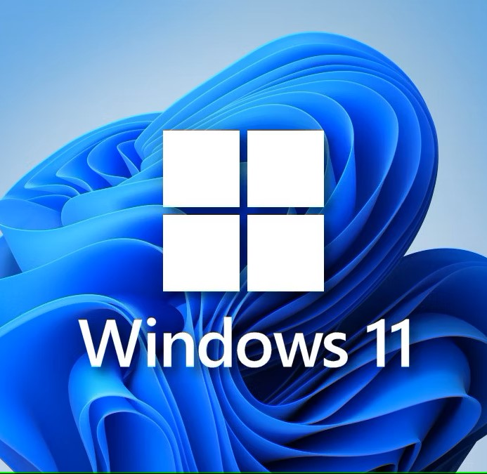
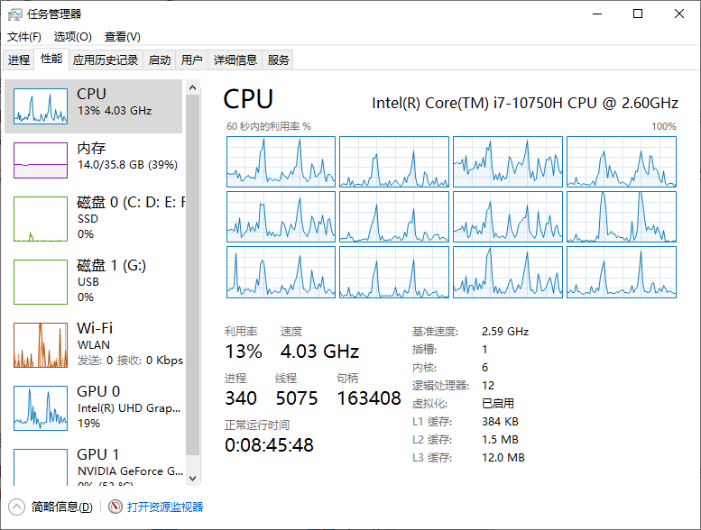
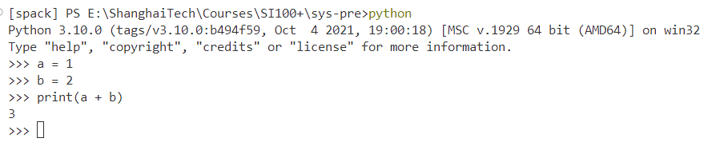
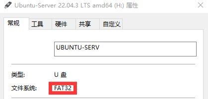
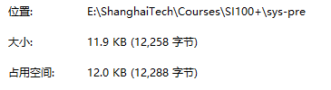
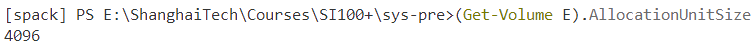

# SI100+ 系统方向介绍
  by 张涵锐
  powered by Marp

---

# 我是谁？

<center>

<div style="display:flex">
  <div style="width:50%">
    <a align="center">
      <br>
      <b>张涵锐</b><br>
      <font size=6> zhanghr2022@shanghaitech.edu.cn </font><br>
    </a>
</div>
  <div style="width:50%">
    <br>
      2022 级 CS 专业本科生
    </br>
    <br>
      曾担任 CS100 助教
    </br>
    <br>
      现任 Geekpie_HPC 超算队队长
    </br>
    <br>
      HPC 比赛教程主编之一：github.com/Ayanokoji-li/HPC-tutorial
    </br>
    <br>
      QQ: 1546169856
    </br>
    <br>
      常驻信院 1B205
    </br>
</div>
</div>

</center>

---

# 系统……操作系统？
<center>

<div style="display:flex">
  <div style="width:33%">
    <br>
  </div>
  <div style="width:33%">
    <br>
  </div>
  <div style="width:33%">
    <br>
  </div>
</div>

</center>

### 这只是系统方向的冰山一角

---

# 计算机系统 - 从探索你的电脑开始

<div style="display:flex">
  <div style="width:80%">
    <br>对于Windows用户：
    <br>
    <br>右键你的任务栏，选择“任务管理器”
    <br>点击“详细信息”，选择“性能”一栏
    <br>
    <br>计算机部分硬件的状态都显示在这里！
    <br>
    <br>简单来说，计算机专业的系统方向，
    <br>就是让你所有的硬件协同工作
    <br>
    <br>如何做到这一点？
  </div>
  <div style="width:100%">
  <center>
    <br>
    <br>
  </div>
  </center>
</div>

---

# 计算机系统 - 体系结构

> 一生二，二生三，三生万物

所有系统方向的研究，都离不开体系结构。
- 你的计算机需要哪些硬件组成？
  - *在百度贴吧中搜索“图拉丁吧”，你会得到闻所未闻的答案，包括但不限于：*
    *萝卜散热，鞋盒机箱，……*
  - 看起来，有些硬件并不是计算机所必须的，而有些硬件却总是会出现在你的配置单上，比如CPU。
  - 其实，不管你的电脑配置怎么变化，都离不开80年前的结构设计：
    冯 · 诺依曼架构

---

# 体系结构 - 冯 · 诺依曼架构

冯 · 诺依曼架构的计算机由5个部分组成：

- 控制单元：指示你的计算机应该做什么
- 处理单元：承担计算任务
- 内存：存储会被立即使用到的数据
- 外存：长期数据存储
- 输入输出设备：让你的计算机能够与外界沟通
- ref: https://en.wikipedia.org/wiki/Von_Neumann_architecture

这5个部分无关具体的硬件！实现对应功能的硬件就是对应的部分
*你自己也可以当做是一个冯 · 诺依曼架构的计算机。想想这5个部分对应哪些东西*

---

# 体系结构 - 冯 · 诺依曼架构

<div style="display:flex">
  <div style="width:80%">
    <br>CPU：控制单元，处理单元
    <br>
    <br>内存条：内存
    <br>
    <br>硬盘：外存
    <br>
    <br>Wi-Fi：输入输出设备
    <br>
    <br>GPU：处理单元
    <br>
    <br>还有别的吗？
  </div>
  <div style="width:100%">
    <br>
    <br>
  </div>
</div>

---

# 体系结构 - 汇编指令

我们按照冯 · 诺依曼架构，把电脑组装起来了。我们要怎么~~教它做事~~告诉它该做什么呢

- 在 Python 的学习中，我们用诸如"print"等函数，和一系列运算符"+", "-"来告诉计算机应该做哪些事。
- 遗憾的是，我们的各个硬件只认识"0"和"1"，它们记不得许多名字。
- 于是，我们用0和1构成的串来表示我们常用的一些操作，例如
  - 用000表示做加法（`add`），以及其他规定。
  - 这样，实现特定功能的01串就有了具有一一对应关系的别名。
  - 要想计算机做一连串的操作，我们就排列一连串的别名，就像写 Python 那样。
  - 这就是汇编指令。汇编指令可以转换成计算机可以阅读的01串，而01串也可以转换成对应的汇编指令。
- *在 steam 上搜索 Turing Complete，探索更多关于体系结构的知识！*

---

# 计算机系统 - 编译原理

看起来，我们的 Python 代码不像是汇编指令：

 - Python 的函数是与01串有一一对应关系的别名吗？显然不是

那么，计算机如何知道我们的 Python 代码究竟想要它做什么呢？

肯定有一个转换的过程。

---

# 编译原理 - 解释器

- 你可能尝试过，在你的terminal中输入`python`，就可以打开python解释器
- 依次输入`a = 1`, `b = 2`, `print(a + b)`，python解释器输出了`3`
  <div style="width:100%">
      <br>
  </div>
- python解释器将你的python代码转换为了汇编指令，进而变成了01串。这样，计算机就可以知道你想要做什么了。

---

# 编译原理 - 解释器

上述过程所生成的汇编指令有可能是这样的：
```
let a 1
let b 2
add c a b
print c
```
它既没有`=`, `+`等运算符，也没有`(`,`)`这些标识。事实上，python解释器按照了一定的规则，“理解”了你的这些符号，并生成了汇编指令。

---

# 编译原理 - 编译器

我们的python代码需要借助python解释器来运行。可是，电脑上这么多的exe文件，难道都要借助解释器来运行吗？

- 这一类文件被称为“二进制文件”。顾名思义，它们本身就是一堆01串。
- 什么能人能够直接写一大堆汇编指令？还是说，解释器承担了所有？
- 都不是 —— 编译器完成了把一大堆代码变成01串，并生成二进制文件的工作。

---

# 编译原理 - 编译器

> 彼童子之师，授之书而习其句读者

阅读一段文章，我们需要根据语法来分析句子结构，理解含义。而编译代码，编译器也需要根据约定好的语法来分析代码结构，“理解”功能，从而输出二进制文件。我们以编译 python 代码为例：

- 词法分析 (lexical analysis)：编译器首先会检查你的代码是否符合事先约定的语法：
  - 你的函数是不是用`def`声明的，
  - 你的`if`语句是否加了`:`
  - ...
- 简单来说，就是检查你的代码是否“看起来”像一段 python 代码
- 如果有任何不满足事先约定的语法的代码，编译器就会指出出错的位置
- 这就如同指出 "How is you" 句中的语法错误一样

---

# 编译原理 - 编译器

- 语义分析 (semantic analysis)：通过了词法分析后，编译器就会试图“理解”代码：
  - 你的`if`, `while`语句要遵循什么条件
  - 你的`for`等循环语句需要如何更新迭代变量
  - 以及最重要的，类型检查 (type checking)
- 类型检查，即你的代码各个变量的类型是否与当前位置所要求的类型匹配。

  > 在 Piazza 中，有这样的问题：当 a, b 均为 str 时, a + b + 0 是否可以正常求值?
  > python 解释器会给出：TypeError: can only concatenate str (not "int") to str

  在这里，没有任何一个规则允许一个 str 和一个 int 使用 `+` 运算，于是这段代码就没有通过类型检查。
- 你也可以进行类比，想想 "Pig is flying" 是否合理。显然，主语需要一个具有 "fly" 能力（函数）的物体，无论是鸟类还是飞机。当然，它可以通过前面的词法分析

---

# 编译原理 - 编译器

- 优化 (optimization)：有的编译器在“理解”了你的代码之后，认为有更优的办法做到对应的功能，于是会对生成的汇编指令进行调整。例如：
  ```
  a = 0
  for i in range(1, 100):
    a += i
  ```
  编译器~~如同高斯在世~~会直接把1到100加起来，然后给出`a = 5050`。这样，程序在每次运行时，就不必重复计算了。
- 最后，编译器会输出对应功能的汇编指令，并生成二进制文件

---

# 编译原理 - 代码查重

> 那里甚么恩义？你只不惹祸不牵带我就罢了！

代码查重的机理就与编译原理有关
  - 修改变量名，函数名是不能通过代码查重的。你的代码结构本质上并没有改变
  - 些微移动你的语句也不能通过代码查重。在语义分析阶段，编译器会知道你的变量都是在同一段代码创建，在同一段代码最后使用的。这被称为“数据流 (data flow)”
  - 将`for`更改为`while`同样不可取。在编译器眼中，这些都是循环。这被称为“控制流 (control flow)”
  - 某些复杂的代码变换，在编译器进行优化之后，汇编指令都是一样的。~~你的闪电五连鞭未必比得过年轻人的偷袭~~

*ChocoPy 是 Python 3.6 的子集，是能被编译的"Python 代码"，详见https://chocopy.org/*

---

# 间章 - 二进制文件

不是所有的二进制文件都可以运行：
- 如何知道哪些文件是二进制文件？简单的办法是使用记事本打开它们。如果你发现~~古神的低语~~乱码，那它们很有可能是二进制文件。
- 在`C:\Windows\System32`目录下，你可以找到许多`.dll`文件。虽然它们是二进制文件，但是你并不能运行它们。
- 甚至压缩包也是二进制文件！
- 事实上，二进制文件只是用01串来记录信息的文件，只不过记录了特定信息的01串才可以运行。

---

# 计算机系统 - 操作系统

记录了特定信息的01串的二进制文件才能被运行：

- 这个特定信息是什么？它就是汇编指令吗？
  - 你尝试过在手机上运行你的电脑程序吗？为什么很多 app 要分手机版和电脑版
- 显然，没有汇编指令，不能运行程序；只有汇编指令，也不一定能运行程序
- 可被运行的二进制文件还记录了哪些信息？
- 由你的操作系统决定！

---

# 计算机系统 - 操作系统

> 正在配置更新，请不要关闭你的计算机

操作系统为运行大部分程序提供了一定的便利：

- 不借助虚拟机的话，你的电脑同时只能运行一个操作系统
  - 但是你在windows或者其他操作系统下可以运行多个程序（多进程）
  - *虚拟机，简单来说就是可以让你在某个操作系统下运行另一个操作系统*
- 方便你的程序执行输入输出等操作
  - 你的 python 代码使用`print`函数进行输出，而操作系统会帮你完成诸如传达指令给显示设备等操作
  - 简单来说，包括文件读取在内，操作系统会帮你完成与硬件有关的操作
- 保障安全
  - 操作系统通过划分不同的权限组，限制了程序的行动范围
  - 你在安装某些 windows 程序时，通常会要求你授予管理员权限

---

# 操作系统 - 文件系统

你曾经试过往你的U盘里塞大于 4GB 的单个文件吗？

- 某些U盘不支持这样的操作。可是，为什么它能放到电脑的硬盘里？
   - *GB：在这里是衡量一个文件存储了多少信息的单位*
- 打开“此电脑”，右键你的U盘，可以看到“文件系统”条目
  <div style="width:100%">
        <br>
  </div>
- 文件系统负责管理某个磁盘里存储的文件, 它管理的方式决定了单个文件的最大体积
- FAT32 的文件管理方式，决定了在这个文件系统下，单个文件最大只能是 4GB
- 通常 windows 系统会将你的硬盘设为 NTFS 文件系统，因而支持大于 4GB 的文件

---

# 操作系统 - 文件系统

为什么文件会区分“大小”和“占用空间”？

- 通过右键这篇 PPT 的`.md`文件，在“属性”中，大小和占用空间并不相同
  <div style="width:100%">
        <br>
  </div>
- 在 powershell （你可以直接使用你 VSCode 的终端）中输入以下指令：
  <div style="width:100%">
        <br>
  </div>
  这里告诉了你E盘的单元大小为 4096 字节

---

# 操作系统 - 文件系统

为什么文件会区分“大小”和“占用空间”？

- 一个硬盘会被文件系统划分为特定的单元大小，就像一个个小隔间一样
- 一个单元只能被一个文件使用。在前面的例子中，文件的大小为 12258 字节，需要三个单元才能装下，所以占用空间为 3 $\times$ 4096 = 12288 字节
- 如何选择硬盘的单元大小？
  - 单元越小，自然空间利用率就越高
  - 但是存储某个文件的单元可能分散在硬盘的不同位置
  - 读取文件时，操作系统会需要到不同位置找到这些小单元
  - 小单元会降低文件的读取速度
  - 合理选择硬盘的单元大小

---

# 操作系统 - 文件系统

在磁盘的属性中，还有“格式化”这一选项

- 直观的感受就是，它可以删除你硬盘里所有的文件
- 在这个过程中，操作系统会重新建立这个硬盘里的文件系统和单元大小等东西
- 你可以根据需要，选择合适的文件系统和单元大小

---

# 操作系统 - 文件系统

你的 C 盘有爆满的时候吗？这里会介绍一种清理 C 盘的方法

- 首先，不要当 C 盘战士。C 盘是存放系统文件的分区，~~什么都往 C 盘里塞只会害了你~~当你需要重装系统时，有时会格式化 C 盘。你并不希望失去你的重要文件
- 分一个 D 盘放别的文件是一个好的习惯
- 某些文件和文件夹看起来只能放在 C 盘。有没有办法可以把他们放在别的盘里呢？
- 创建符号链接！

---

# 操作系统 - 文件系统

你的 C 盘有爆满的时候吗？这里会介绍一种清理 C 盘的方法

- 直观感受文件夹是怎么实现的：
  <div style="width:100%">
      <br>
  </div>

  通过这样一条路径：`E -> ShanghaiTech -> Courses -> SI100+ -> sys-pre`
- 符号链接，可以实现类似文件夹的效果：指向另一个位置的文件 / 文件夹
- 就像快捷方式一样，但这是文件系统自带的功能
- 在 windows 下，可以通过`mklink`来创建符号链接。使用`mklink /d`可以创建指向某个文件夹的符号链接
- 你可以把某些必须放在 C 盘的文件移到别的地方，再在原来的位置创建符号链接

---

# 计算机系统 - 高性能计算

> 550W听起来不像个名字。但把它翻过来，叫MOSS。直译为小苔藓。是不是可爱了一些

任何 AI 的运行都离不开能承载它的设备。而高性能计算的研究方向，就是实现并尽可能优化能够承担诸如 AI 运行这样需要大量计算的设备。

- 简单来说，高性能计算（HPC）就是造 550W 的（当然，实际上你可能需要移步隔壁的量子计算）
- 除了运行 AI，气象模拟、分子动力学、流体力学这些学科都需要高性能计算的支持

---

# 高性能计算 - 优化

一个程序的运行速度主要由3个因素决定：计算、存储、输入输出

- 这和考试有点像：你做不完试卷的时候，是什么影响了你的速度？
  - 计算：在数学考试中，你需要思考解决办法。
  - 存储：在做阅读题时，你是多次阅读原文？还是很快就能知道大部分内容？
  - 输入输出：你的阅读速度和写字速度。
- 正如不同的考试，影响做题速度的因素不同；影响一个程序的主要因素也不同

---

# 高性能计算 - 优化

- 计算：在 CS 专业中，CCPC 和 ICPC 是两个含金量比较高的算法竞赛
- 事实上，这两个竞赛可以看做是专门优化程序计算速度的
  - 算法，就是解决某个问题所使用的方法
  - 不同的算法，解决同一个问题所花费的时间也不同
- 通常，算法的优化，会交给甲方来做（比如气象模拟、流体力学什么的）
- 一般你不需要知道这些算法背后的科学原理

---

# 高性能计算 - 优化

- 计算：除了算法的优化，想要优化计算，还可以通过并行入手
  - 在被罚抄的时候，两支笔一起写肯定比只用一支笔写更快
  - 当过课代表的同学可能也知道，多个人一起发作业也比一个人快
- 在高性能计算中，并行，就是同时完成一些没有前后依赖关系的任务
  - 通过递推式计算斐波拉契数列时，计算一个数$a_n$需要知道它的前两个数
  - 我们只有计算好它前面的数，才能计算$a_n$
  - 显然这样是不能并行计算的
  - 而通过通项公式计算斐波拉契数列时，想知道某些数的值，我们可以直接分配对应的计算任务给计算机的处理单元
- 通过某些转换，消去某些任务的前后依赖关系，就可以并行计算更多的数据

---

# 高性能计算 - 优化

- 存储：某些程序需要频繁访问内存与外存。优化存储，就是优化数据交互的速度
- 通常来讲，程序在访问数据时有以下特性：
  - 局部性：程序在某一段时间内只会使用固定范围内的数据。
    - 你在复习的时候，会在一段时间内固定复习某个科目
  - 高频性：程序在某一段时间内会频繁使用到某个数据
    - 做数学题的时候，会经常使用到某个计算的结果
- 因此，在体系结构中，我们提出了“缓存”的概念

---

# 高性能计算 - 优化

<div style="display:flex">
  <div style="width:80%">
    <br>存储：
    <br>任务管理器的CPU视图
    <br>展示了三级缓存的大小
    <br>
    <br>可以发现，缓存等级越高，
    <br>容量也就越大
    <br>但其实访问速度也会越慢
    <br>
    <br>针对内存的优化，就是
    <br>在保证局部性的同时
    <br>尽量把数据放到低级的缓存中
  </div>
  <div style="width:100%">
  <center>
    <br>
    <br>
  </div>
  </center>
</div>

---

# 高性能计算 - 优化

- 输入输出：不要忘了，在体系结构一节，Wi-Fi也算作输入输出设备
- 事实上，在高性能计算中，通常不止有一台计算机在承担计算任务
- 由于并行的需要，有时会使用多个计算机同时计算。它们通过网络交换数据
- 针对输入输出的优化，大部分就是针对网络数据交换的优化

---

# 高性能计算 - 优化

> 百度网盘：32 kB / s

- 输入输出：网络的数据交换速度，相较于内存来说，是极其缓慢的
- 优化网络数据交换，其实是尽可能减少计算机之间不必要的数据交换

---

# 高性能计算 - 高频交易

除了前面介绍的几个领域，事实上，金融领域也需要高性能计算

- 经常炒股的同学都知道，股票市场瞬息万变，风云莫测
- 如果能~~听风就是雨~~捕捉到市场的信号，及时买入或卖出，就可以赚取大量差价
- 利用高性能计算的知识，可以优化这样的程序的速度
- 程序的反应速度甚至可以达到微秒的级别

---

# 高性能计算 - 广告

GeekPie_HPC 超算队即将开始新一轮的队员招募
- 超算比赛，就是利用高性能计算的知识，优化各种 AI 的运行，和科学计算的模拟
- 跟 AI 没关系！我们可以不用了解各种 AI 算法，只专注于运行速度的优化
- 欢迎感兴趣的同学课后联系我：QQ 1546169856 | email zhanghr2022@...
- 愿意进一步了解 HPC 的同学，欢迎前往 GitHub 阅读并 star 教程：
  - https://github.com/Ayanokoji-li/HPC-tutorial

---

# 计算机系统 - 嵌入式开发

> Man! What can I say?

<div style="display:flex">
  <div style="width:50%">
    <br>
    <br>右图是由一个学长自研的一款牢大模拟器。
    <br>你将在一块芯片上控制牢大的直升机。
    <br>
    <br>中间忘了
    <br>
    <br>后面忘了
</div>
  <div style="width:50%">
    <center>
    <video width="270" height="480" controls>
      <source src="img/man.mp4" type="video/mp4">
    </video>
    </center>
  </div>
</div>

---

# 计算机系统 - 嵌入式开发

简单来说，嵌入式开发，就是直接跟芯片一类的硬件打交道

- 这些芯片通常与我们电脑里的芯片不同。它不会承担各种复杂的任务，因此也不会有特别高的性能。但是它通常集成了内存等部件
- 运行在这一类芯片上的系统通常是实时系统（RTOS），用于承担网络设备或者智能设备的交互
- 你也可以编写不需要操作系统就能运行的程序！通常这类程序承担了更简单的任务，比如一些机械控制之类的
  *当然也包括前面牢大的直升机！你会在未来的必修课里学到的*

---

# 计算机系统 - 尾声

我在 HPC 教程的开始部分推荐了《计算机教育中缺失的一课》
  - https://missing-semester-cn.github.io/
  - 在日后计算机课程的学习中，你会逐渐使用到这个课程里介绍的各种工具
  - 几乎没有课程会介绍如何使用这些工具。但是无论你以后或是进组，或是实习，你的老板都会默认你已经学会了这些工具

想要了解如何获取信息，你还需要阅读《提问的智慧》
  - https://github.com/tvvocold/How-To-Ask-Questions-The-Smart-Way
  - 事实上，无论你是否以后会学习计算机课程，你都应该提升自己获取信息的能力
  - 不要做学术丁真！

---

# 计算机系统 - 尾声

这篇有关计算机系统方向介绍的 PPT 是基于 VSCode 的 Marp 的插件完成的

- 使用 Markdown 进行写作，可以较为方便地排版
- 而 Marp 插件，可以借助 Markdown 的语法，在 VSCode 中制作 PPT
- 你不再需要为了排版而花费更多的时间
- 本 PPT 所使用的配置：
```
marp: true
math: mathjax
paginate: true
style: |
  section::after {
    content: attr(data-marpit-pagination) '/' attr(data-marpit-pagination-total);
  }
```

---

# 感谢聆听！